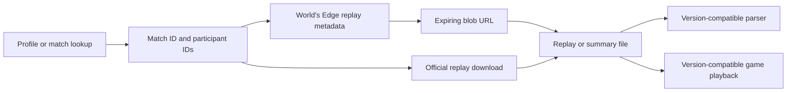

# AoE4 replays, parsers and local game APIs

**Mixed origins:** publisher replay endpoints and the SCAR game API are separate from independent replay parsers and file-format tools. Source inspection, local reference files and live download samples establish different things. [Operator and evidence definitions](../publisher-services.md).

There are three different tasks: **find/download a replay**, **parse an existing recording or summary**, and **run rules inside a game**. An API that handles one does not automatically provide the other two.

## Replay discovery and download

### World’s Edge metadata route

```http
GET https://aoe-api.worldsedgelink.com/community/leaderboard/getReplayFiles?title=age4&matchIDs=%5B250457718%5D
```

Successful responses contain `result`, `expiryUnix` and `replayFiles[]`. File entries expose `profile_id`, `matchhistory_id`, `url`, `size`, `datatype`. The tested eight-player match returned 16 entries on both the common and `dr-activerelease1` host. This does not establish that all 16 files were uploaded, downloadable or playable.

The [launcher implementation](https://github.com/EKYavsil/AoE4-Replay-Launcher/blob/7543f21d75a9cb76e5fae9c2ba104cd5a2b819e3/src/aoe4replay/aoe4world.py) selects `datatype=0` for full replay files. The [LibreMatch reference](https://github.com/LibreMatch/wiki/blob/fdb932e9eb6cff5f7dd8d1d46c7fbcc8202d0419/src/rlink/community/leaderboard/getreplayfiles.md) identifies AoE4 `datatype=1` as statistical summaries and documents `size=-1` for files that were not uploaded. These meanings are source-backed; this research did not download every returned type.

A practical workflow:

1. Obtain a known match ID from a profile/history API.
2. Request its replay metadata once; require application success.
3. Select the needed datatype and perspective; skip known invalid/missing-size entries.
4. Fetch the returned URL promptly, while valid, then cache the actual file if needed.
5. Validate payload structure before saving a replay. Preserve match/profile/build provenance.

Read `expiryUnix`; do not hard-code the launcher’s approximate six-minute observation as a provider guarantee. Do not store signed URLs as durable replay IDs or include their signatures in logs. No batch maximum or replay-retention duration was tested.

### Official website download route

```http
GET https://api.ageofempires.com/api/GameStats/AgeIV/GetMatchReplay/?matchId=250457718&profileId=4635035
```

This request returned HTTP 200, `Content-Disposition` naming `AgeIV_Replay_250457718.gz`, and a gzip prefix that decompressed to bytes containing `AOE4_RE`. This verifies a plausible replay payload for this perspective; it is not a complete parse or an in-game playback test. The probe stored headers/hash and the validation result, not the replay itself. [Evidence](../../evidence/2026-09-19/official-probes.json).

The supplied launcher handles both routes and has a fallback policy, but some of its comments are stronger than the evidence: a `NOT_FOUND` result on one service should not be treated as proof about all services, all perspectives or permanent deletion unless the publisher documents that relationship.

Match patch compatibility and client replay-loading support remain separate issues. The [official support procedure](https://support.ageofempires.com/hc/en-us/articles/34920298779540-Downloading-Replay-Files-through-the-Age-of-Empires-Stats-page) describes an AoE4 Steam workflow and warns about version compatibility. That procedure does not prove playback via a Microsoft Store command line. No game was launched or settings changed during this research.



## aoe4world/replays-api: self-hosted parser interface

[Source repository](https://github.com/aoe4world/replays-api), inspected at [`efc391296451da352c3660daf814403e37e787e8`](https://github.com/aoe4world/replays-api/tree/efc391296451da352c3660daf814403e37e787e8).

Despite the repository name, the controller inspected here exposes **summary parsing** operations. It is not evidence of a public hosted AoE4 World endpoint into which arbitrary full replays can be uploaded. No production base URL or public service quota is promised in its README.

| Local GET route | Input | Output / implementation |
| --- | --- | --- |
| `/Summary?url=...` | URL of gzip summary | New parser, converted into compatible player-summary output |
| `/Summary/old?url=...` | URL of gzip summary | Older parser output |
| `/Summary/new?url=...` | URL of gzip summary | Object containing `gameSummary` and `replaySummary` |
| `/Summary/file?path=...` | Server-local gzip file path | Older parser output |
| `/Summary/newfile?path=...` | Server-local gzip file path | New parser and generated summary |

Source: [SummaryController.cs](https://github.com/aoe4world/replays-api/blob/efc391296451da352c3660daf814403e37e787e8/AoE4WorldReplaysAPI/Controllers/SummaryController.cs). All five operations were identified in source and were **not runtime-tested** here. The path is a path on the parser server, not automatically the browser/client machine.

The [program configuration](https://github.com/aoe4world/replays-api/blob/efc391296451da352c3660daf814403e37e787e8/AoE4WorldReplaysAPI/Program.cs) enables Swagger only in development and has authorization middleware commented out. Because these operations open local paths or fetch URLs, keep a research deployment local/trusted and define access controls before exposing it. This is a property of the inspected implementation, not an assertion about AoE4 World’s private production deployment.

The repository includes binary layout templates and historical examples. Its README explicitly requires version-aware parser changes. Rich economy/build-order summaries depend on the availability and format of a summary file; downloading a full replay is not equivalent to receiving every statistic in structured JSON.

## Authenticated summary access

[RTSLytics/AOE4-Analytics](https://github.com/ccsimplyspolit/AOE4-Analytics/blob/2766f54c2575d1f9222650a01ea5591d7d2a5a22/electron/services/relicAuthService.ts) documents an additional implementation path: a Steam app ticket, `/game/login/platformlogin`, `/game/cloud/getTempCredentials`, and a datatype-1 blob. Its code demonstrates that some tools integrate session-bound services.

This is an implementation lead, not an approved public-authentication specification or a guarantee those steps are required for every currently public summary. Session creation and cloud credentials were not exercised. No credentials, tickets, or user login state were inspected.

## AOEMods.Essence: file-format library and CLI

[AOEMods.Essence](https://github.com/aoemods/AOEMods.Essence) is a C# library plus CLI/editor for Essence-engine files. The project documents SGA archive read/write/unpack, RGD conversion to XML/JSON, RRTEX textures, RRGEOM models, and the Relic Chunky container.

This is useful for extracting game definitions and assets or implementing local format readers. It is not a network match API and does not make the game’s entire simulation externally controllable. Its [README](https://github.com/aoemods/AOEMods.Essence/blob/master/README.md) lists commands including `sga-unpack`, `rgd-decode`, `rrtex-decode`, `rrgeom-decode`. Binary/build compatibility should be checked against the target game files before assuming support.

## SCAR and the Content Editor

AoE4’s local scripting interfaces can read and modify in-game state inside mods. Official starting points are [Editing a Script](https://support.ageofempires.com/hc/en-us/articles/4424274153620-Editing-a-Script) and [Editing a Win Condition](https://support.ageofempires.com/hc/en-us/articles/4421721200532-Editing-a-Win-Condition).

| Surface | What it controls |
| --- | --- |
| Game Mode SCAR/Lua | Match lifecycle, objectives, rule scheduling, player setup and victory logic |
| Tuning Pack attributes | Unit, weapon, ability, economy and other data definitions |
| Crafted / Generated Maps | Terrain, starting layout and map generation |
| Editor templates and imported SCAR helpers | Higher-level functions layered over the engine API |

Documented lifecycle callbacks include `_OnGameSetup`, `_PreInit`, `_OnInit`, `_Start`, `_OnPlayerDefeated`, `_OnGameOver`, prefixed by the registered module name. Scheduling helpers include `Rule_AddOneShot`, `Rule_AddInterval`, and `Rule_AddGlobalEvent`. Lobby options are read with `Setup_GetWinConditionOptions`. These are local game-mode interfaces; they are not HTTP endpoints. [Official scripting reference](https://support.ageofempires.com/hc/en-us/articles/4424274153620-Editing-a-Script).

The installation on this machine contains:

```text
/mnt/c/XboxGames/Age of Empires IV/Content/scardocs/html/frameset.htm
/mnt/c/XboxGames/Age of Empires IV/Content/scardocs/html/function_list.htm
/mnt/c/XboxGames/Age of Empires IV/Content/scardocs/api/Essence_ScarFunctions.api
/mnt/c/XboxGames/Age of Empires IV/Content/scardocs/api/Essence_Constants.api
```

These paths were verified read-only on 2026-09-19. They are installation-specific, not default paths on every PC. The function file was 300,003 bytes and yielded 1,969 distinct names through a simple signature-name extraction; this includes engine/development functions and is **not a count of guaranteed mod-accessible calls**. [Hashes and extraction metadata](../../evidence/2026-09-19/local-scar-metadata.json).

Major function families include `Entity_*`, `Squad_*`, `Player_*`, `World_*`, `UI_*`, `Camera_*`, `AI_*`, `Obj_*`, `SGroup_*`, `EGroup_*` and `FOW_*`. Checked examples include `Entity_GetLastAttacker`, `Player_SetResource`, and `Squad_CreateAndSpawnToward`. Full installed signatures provide the exact argument types.

Helper functions described in the official Lua framework may not appear in the generated engine `.api` file. Conversely, an engine symbol’s presence does not establish that it is safe or synchronized in multiplayer. Mod testing must establish behavior and determinism; this documentation pass made no runtime claims.

## What was not established

No supported external AoE4 API for arbitrary live unit commands, full real-time unit positions, or complete simulation telemetry was found in the consulted sources. Lobby listings and match-state polling provide a different level of information. No authenticated matchmaking/session endpoint was tested; no local binary was patched; no replay parser was built or game playback attempted.

## ageLANServer replay and session boundaries

The [ageLANServer review](../agelanserver.md) adds a session WebSocket and lobby/observer serializers. Its `finalizeReplayUpload` handler only returns `[0]`, and its cloud-credential implementation explicitly leaves AoE4 replay handling unresolved. These routes do not add a verified replay storage or live unit-state API. Use the earlier public replay evidence for download integration.
